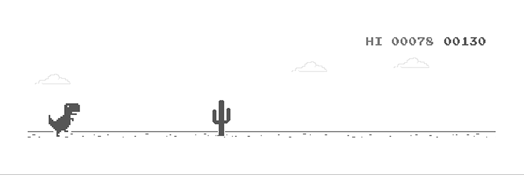

# Asraful Islam  

###  **Hello world!**  

  <em>
    I am a recent graduate of <a href="https://daffodilvarsity.edu.bd//"> <b>Daffodil International University</b>, Dhaka, Bangladesh</a>.  
    A skilled  <b>Flutter Developer</b>  who is <b>passionate</b> about <b>continuous improvement</b> and honing my skills 
  </em>  

 

-  I’m *currently* **dedicated** to my **career** 🎓
-  I’m *constantly* **learning and growing** 👨‍💻   
-  I’m *open to collaborate* on **exciting  Flutter projects**.

 

## 🚀 Languages and Tools:

 

 
    
     
    <a href="https://nodejs.org/" target="_blank"> &nbsp;&nbsp;</a>
    
    
    <a href="https://www.thunderclient.com/" target="_blank"> &nbsp;</a>
    <a href="https://www.apachefriends.org/index.html" target="_blank"> &nbsp;&nbsp;</a>
    <a href="https://git-scm.com/" target="_blank"> &nbsp;&nbsp;</a>
    <a href="https://github.com/" target="_blank"> &nbsp;&nbsp;</a>
    <a href="https://code.visualstudio.com/" target="_blank"> &nbsp;&nbsp;</a> 
    <a href="https://developer.android.com/" target="_blank"> &nbsp;&nbsp;</a> 
    <a href="https://developer.apple.com/xcode/" target="_blank"> &nbsp;&nbsp;</a> 
     

 
    <table align="center">
        <tr>
            <td>
              <!-- Streak Stats-->
              

            </td>
        </tr>
   </table>
<table align="center">
    <tr>
        <td>
            <!-- GitHub Stats-->
            
        </td>
        <td>
            <!-- Most Languages-->
            
        </td>
    </tr>
</table>

<!-- Contribution Graph -->

  

 

# Connect with me

|  |  | |  |  
|:---:|:---:|:---:|:---:|:---:|

 

<!-- profile visit -->

<!--  -->

